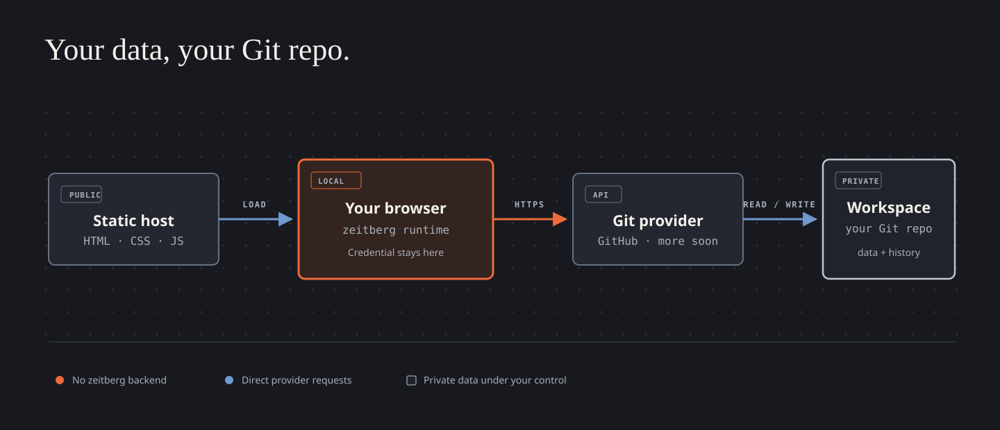

<p align="center">
  
</p>

<h1 align="center">planplural</h1>

<p align="center">
  <strong>Many plans. One place you own.</strong><br />
  A static personal-operations workspace whose data lives in your Git repository.
</p>

<p align="center">
  
  
  
  
</p>

---

planplural is a keyboard-first home for time tracking, TODOs, and the other small systems that make up everyday life. The public application is plain HTML, CSS, and JavaScript. It has no planplural-operated application server and no database.

Instead, you choose a private Git repository as a workspace. The browser reads and writes its versioned documents directly through your Git provider API. You can inspect the data, clone the entire history, make independent backups, or move it elsewhere without asking planplural for an export.

> Your tools may be hosted. Your life should not be.

<p align="center">
  
</p>

## What it gives you

| Component | Today |
| --- | --- |
| **Time** | Responsive weekly timeline, keyboard and touch editing, search, billable totals, work-hour requirements, overtime accumulation, undo/redo, and manual Git commits. |
| **TODOs** | Shared projects and sections, recurring tasks, filters, completion history, durable drafts, Todoist import, and optional GitHub issue linkage. |
| **Workspace** | A versioned root manifest, portable JSON documents, stable project identities, private Git history, and direct browser-to-provider persistence. |
| **Next** | Finances, additional providers, capability links, restorable URL routing, and agent integration are tracked in [GitHub Issues](https://github.com/josephbirkner/planplural/issues). |

The project is intentionally one application: time, tasks, and future components share a project inventory and workspace identity while retaining separate documents and views.

## Workspace setup

GitHub is available now. GitLab, Codeberg/Forgejo, and compatible private Git servers are planned; the provider-neutral workspace model is already separated from the GitHub implementation.

1. Create a **private** repository for your data.
2. Copy the contents of [`workspace-template`](./workspace-template) into it.
3. In `planplural.json`, replace `workspace_id`, set the name and IANA timezone, then commit and push.
4. Create a fine-grained GitHub personal access token for that repository:
   - `Contents: Read-only` is enough to browse.
   - `Contents: Read & write` is required to save.
5. Visit [planplural.io](https://planplural.io), enter the repository URL, branch, and token, then open the workspace.

A shell-based start looks like this after cloning this application repository:

```bash
mkdir planplural-data
cp -R workspace-template/. planplural-data/
cd planplural-data
git init
# Edit planplural.json before the first commit.
git add .
git commit -m "Initialize planplural workspace"
gh repo create YOUR_ACCOUNT/planplural-data --private --source=. --push
```

The token is kept in session storage by default. Selecting **Remember this token** opts into local storage. Authenticated requests go directly from the browser to `api.github.com`; the static host never receives the credential.

If a project is bound to another GitHub repository for issue synchronization, the token additionally needs `Issues: Read & write` for that repository. Workspaces without such a binding do not need issue access.

## How the workspace works

`planplural.json` is the versioned bootstrap document. It declares:

- a stable workspace ID, name, and timezone;
- shared resources such as `data/projects.json`;
- enabled component types;
- repository-relative paths owned by each component.

The default template has this shape:

```text
planplural.json
data/
├── entries/                     # weekly files created as needed
├── index/entries-manifest.json
├── projects.json                # shared by time entries and TODOs
├── todos.json
└── week-requirements.json
```

Time entries are normalized into ISO-week files. Their manifest records immutable Git blob SHAs, allowing IndexedDB to cache chunks safely without confusing an old revision for a new one. Unsaved time and TODO changes are also journaled in IndexedDB and removed only after a successful manual save; that journal protects against reloads but is not a substitute for a Git commit.

TODOs and time entries share the schema-v2 project/section taxonomy. Assignments use stable `project_key` and `section_key` values, so display names can change without rewriting historical entries.

## GitHub issue-linked TODOs

A workspace project can opt into GitHub issue persistence with an external reference:

```json
{
  "external_refs": [
    { "provider": "github", "id": "owner/repository" }
  ]
}
```

Sections may identify their issue label through a `github-label` external reference. When an issue-backed TODO is manually saved, planplural creates or updates the corresponding issue first and then commits the TODO document to the workspace repository. The issue number is retained in the TODO's generic source metadata, making retries idempotent and links durable. Local-server mode continues to write workspace files without making remote issue changes.

Legacy tasks whose title or description explicitly names Toggl or Todoist remain private and are not auto-published into the issue tracker.

## Local development

Keep the public application and private workspace as sibling checkouts:

```bash
cd /path/to/checkouts
gh repo clone josephbirkner/planplural
gh repo clone YOUR_ACCOUNT/planplural-data
cd planplural
npm ci
npm test
python3 server.py --workspace ../planplural-data
```

Open <http://127.0.0.1:8000/?source=local>. When the sibling is named `planplural-data`, `--workspace` may be omitted.

Local mode serves application files from this checkout and maps workspace reads plus `POST /save` to the separate data checkout. It writes JSON without committing; review, commit, and push data changes from that repository independently.

Useful checks:

```bash
npm test
npm run typecheck
npm run check:data -- --workspace ../planplural-data
```

The one-way Todoist importer reads its token from `~/.todoist` and never copies it into a repository:

```bash
npm run import:todoist -- --workspace ../planplural-data
```

Use `--replace-todoist` to refresh an earlier import, `--active-only` to omit completed history, or `--completed-since YYYY-MM-DD` to choose an archive boundary.

## Hosting and provider roadmap

The canonical deployment serves this repository from [planplural.io](https://planplural.io). You can also fork and host the same static files yourself, including from a private Pages deployment where your hosting plan supports one.

Planned connectors retain the same architecture:

- GitLab OAuth with PKCE and private-project initialization;
- Codeberg/Forgejo OAuth or a scoped PAT, depending on provider capabilities;
- compatible private Git servers after explicit host and CORS validation.

There is deliberately no GitHub App or OAuth broker today: GitHub's confidential OAuth and GitHub App flows require a server-held secret or private key, while the current fine-grained PAT flow remains fully static.

## Credits and disclosure

The code for this project was written using large language models with extensive human supervision.

The planplural owl mark adapts the **owl** glyph from [Google Material Symbols](https://github.com/google/material-design-icons), used under the [Apache License 2.0](./icons/LICENSE). The architecture graphic is an original SVG whose restrained visual language was informed by Kathryn Lavery's [Diagram Design](https://github.com/cathrynlavery/diagram-design) principles.

No generative or diffusion-based image model was used for the logo or architecture graphic.
