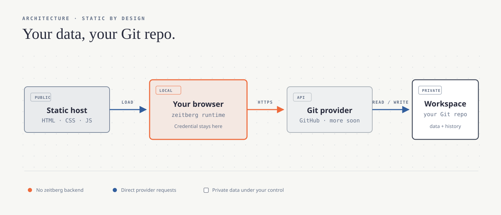

<p align="center">
  
</p>

<h1 align="center">zeitplural</h1>

<p align="center">
  <strong>Time · Tasks · Expenses → Git</strong><br />
  A static browser application whose data lives in your Git repository.
</p>

<p align="center">
  <a href="https://github.com/josephbirkner/zeitplural/actions/workflows/test.yml"></a>
</p>

---

zeitplural manages time and TODOs today, with expenses planned next. The public application is plain HTML, CSS, and JavaScript. It has no zeitplural-operated application server or database.

You choose a Git repository as the workspace. The browser reads and writes versioned documents directly through the provider API. The repository remains independently inspectable, cloneable, and portable.

**Your data, your Git repo.**

<p align="center">
  <picture>
    <source media="(prefers-color-scheme: dark)" srcset="./assets/architecture.svg" />
    
  </picture>
</p>

## What it gives you

| Component | Today |
| --- | --- |
| **Time** | Responsive weekly timeline, keyboard and touch editing, search, billable totals, work-hour requirements, overtime accumulation, undo/redo, and manual Git commits. |
| **TODOs** | Shared projects and sections, recurring tasks, filters, completion history, durable drafts, imports, and optional GitHub issue linkage. |
| **Workspace** | A versioned root manifest, portable JSON documents, stable project identities, private Git history, direct browser-to-provider persistence, and English/German UI. |
| **Next** | [Finances](https://github.com/josephbirkner/zeitplural/issues/24), [bidirectional issue projects](https://github.com/josephbirkner/zeitplural/issues/26), and [test coverage](https://github.com/josephbirkner/zeitplural/issues/29). |

The project is intentionally one application: time, tasks, and future components share a project inventory and workspace identity while retaining separate documents and views.

## Similar projects

No direct equivalent surfaced in our review. The closest projects each overlap with one part of zeitplural:

- [GitJournal](https://github.com/GitJournal/GitJournal) stores Markdown notes in a Git repository of the user's choice.
- [TaskRepo](https://github.com/HenriquesLab/TaskRepo) stores tasks as Markdown files in Git repositories.
- [ActivityWatch](https://github.com/ActivityWatch/activitywatch) is an automated time tracker with user-controlled local data, but is not Git-backed.
- [Actual Budget](https://github.com/actualbudget/actual) is a local-first personal-finance application with its own synchronization model rather than Git storage.

## Workspace setup

GitHub, GitLab.com, Codeberg, and compatible CORS-enabled GitLab/Forgejo servers use the same workspace and save pipeline. GitHub retains its PAT flow. GitLab and Codeberg accept provider tokens now; their Authorization Code + PKCE buttons become active when the deployment's public OAuth client ids are configured.

1. Create a **private** repository for your data.
2. Copy the contents of [`workspace-template`](./workspace-template) into it.
3. In `zeitplural.json`, replace `workspace_id`, set the name and IANA timezone, then commit and push.
4. Create an access token for that repository:
   - GitHub: a fine-grained PAT with `Contents: Read-only` to browse or `Contents: Read & write` to save.
   - GitLab: a PAT with API access, or the static PKCE flow when enabled on the deployment.
   - Codeberg/Forgejo: a repository-scoped token with repository read/write access. Forgejo OAuth grants are currently broader than scoped PATs, which the onboarding dialog states before authorization.
5. Visit [zeitplural.io](https://zeitplural.io), select the provider, enter the repository URL, branch, and token, then open the workspace.

Alternatively, choose **Create workspace** on the landing page. GitLab.com and Codeberg can create a private repository, initialize the checked-in [`workspace-template`](./workspace-template), validate its generated `zeitplural.json`, and open it without any zeitplural-operated backend. If a Forgejo-family server blocks browser cross-origin requests, connection preflight reports that limitation instead of treating it as malformed data.

A shell-based start looks like this after cloning this application repository:

```bash
mkdir zeitplural-data
cp -R workspace-template/. zeitplural-data/
cd zeitplural-data
git init
# Edit zeitplural.json before the first commit.
git add .
git commit -m "Initialize zeitplural workspace"
gh repo create YOUR_ACCOUNT/zeitplural-data --private --source=. --push
```

The token is kept in session storage by default. Selecting **Remember this token** opts into local storage. Authenticated requests go directly from the browser to the selected provider API; the static host never receives the credential. OAuth grants retain their refresh token in the same per-workspace credential record and refresh shortly before expiry.

After opening a workspace, use the first sidebar action beneath the owl to manage connections. The browser keeps an ordered registry of repository URL, branch, bootstrap path, verified workspace ID, and display name. Each workspace token is stored separately, and switching repositories preserves unsaved drafts in a workspace-specific IndexedDB journal. Disconnecting one workspace does not log out or clear credentials for the others.

The same screen can share the active workspace in two forms:

- A **locator link** contains only the provider, repository URL, branch, workspace file and ID, selected component, and current view state. Its recipient supplies a credential independently.
- A **capability link** additionally carries a dedicated repository token in its URL fragment. The fragment is removed from the address bar before zeitplural performs authenticated network activity, and importing it requires explicit consent. Because anyone holding the link receives the token's access, create a least-privilege, expiring token for only that repository and send the link as securely as the credential itself. Imported capability credentials remain in session storage unless the recipient explicitly chooses to remember them.

Ordinary routes, locator links, workspace records, cache keys, and repository documents never contain credentials. A custom provider host also requires a separate trust confirmation before zeitplural sends it an imported capability credential.

The interface language is selected in Workspace settings. English and German share one first-party message catalog; the browser language supplies only the initial default, after which the explicit device preference wins. Dates, weekdays, numbers, durations, and currencies use `Intl` in the selected language while workspace calendar math continues to use the workspace's IANA timezone. Language changes do not alter route paths or write translated interface text into workspace documents.

If a project is bound to another GitHub repository for issue synchronization, the token additionally needs `Issues: Read & write` for that repository. Workspaces without such a binding do not need issue access.

## How the workspace works

`zeitplural.json` is the versioned bootstrap document. It declares:

- a stable workspace ID, name, and timezone;
- shared resources such as `data/projects.json`;
- enabled component types;
- repository-relative paths owned by each component.

The default template has this shape:

```text
zeitplural.json
data/
├── entries/                     # weekly files created as needed
├── index/entries-manifest.json
├── projects.json                # shared by time entries and TODOs
├── todos.json
└── week-requirements.json
```

Time entries are normalized into ISO-week files. Their manifest records immutable Git blob SHAs, allowing IndexedDB to cache chunks safely without confusing an old revision for a new one. Unsaved time and TODO changes are also journaled in IndexedDB and removed only after a successful manual save; that journal protects against reloads but is not a substitute for a Git commit.

TODOs and time entries share the schema-v2 project/section taxonomy. Assignments use stable `project_key` and `section_key` values, so display names can change without rewriting historical entries.

## Routes and browser history

The public root remains the landing and connection page. Initialized views use component-first routes:

- `/time` for the week timeline and Time search;
- `/todos` for tasks;
- `/expenses` for the upcoming expense component.

The query string records the credential-free workspace locator and navigation state such as the selected week or TODO, filters, timeline zoom, and scroll time. PATs are never part of an ordinary route. Meaningful view changes create browser-history entries; high-frequency selection, filter, zoom, and scroll changes update the current entry. A small `404.html` handoff makes direct component-route reloads work on GitHub Pages without server-side rewrites.

## GitHub issue-linked TODOs

A workspace project can opt into GitHub issue persistence with an external reference:

```json
{
  "external_refs": [
    { "provider": "github", "id": "owner/repository" }
  ]
}
```

Sections may identify their issue label through a `github-label` external reference. When an issue-backed TODO is manually saved, zeitplural creates or updates the corresponding issue first and then commits the TODO document to the workspace repository. The issue number is retained in the TODO's generic source metadata, making retries idempotent and links durable. Local-server mode continues to write workspace files without making remote issue changes.

Legacy tasks whose title or description explicitly names Toggl or Todoist remain private and are not auto-published into the issue tracker.

## Local development

Keep the public application and private workspace as sibling checkouts:

```bash
cd /path/to/checkouts
gh repo clone josephbirkner/zeitplural
gh repo clone YOUR_ACCOUNT/zeitplural-data
cd zeitplural
npm ci
npm test
python3 server.py --workspace ../zeitplural-data
```

Open <http://127.0.0.1:8000/time?source=local>. When the sibling is named `zeitplural-data`, `--workspace` may be omitted.

Local mode serves application files from this checkout and maps workspace reads plus `POST /save` to the separate data checkout. It writes JSON without committing; review, commit, and push data changes from that repository independently.

Repeat `--workspace` to test the multi-workspace switcher against several local repositories:

```bash
python3 server.py \
    --workspace ../zeitplural-data \
    --workspace ../zeitplural-shared-expenses
```

The server reads each repository's `workspace_id`, exposes only those explicitly selected roots, and keeps absolute filesystem paths out of browser routes. Local saves include the selected workspace ID so writes cannot cross into another exposed checkout.

### Stylesheet ownership

Styles are loaded explicitly from `styles/`: shared tokens, controls, application chrome, and dialogs belong in `common.css`; time tracking and time search belong in `time.css`; TODOs belong in `todos.css`; and the public site plus login belong in `landing.css`. Keep theme and responsive overrides beside the component they affect. New sub-apps should receive their own stylesheet instead of growing `common.css` by default.

Useful checks:

```bash
npm test
npm run typecheck
npm run check:data -- --workspace ../zeitplural-data
```

The one-way Todoist importer reads its token from `~/.todoist` and never copies it into a repository:

```bash
npm run import:todoist -- --workspace ../zeitplural-data
```

Use `--replace-todoist` to refresh an earlier import, `--active-only` to omit completed history, or `--completed-since YYYY-MM-DD` to choose an archive boundary.

## Hosting and provider authentication

The public deployment serves this repository from [zeitplural.io](https://zeitplural.io). You can also fork and host the same static files yourself, including from a private Pages deployment where your hosting plan supports one.

Provider connectors retain the same architecture:

- GitHub uses a fine-grained PAT and GitHub's REST/GraphQL APIs.
- GitLab uses its REST API, one atomic multi-action commit per save, and [Authorization Code + PKCE](https://docs.gitlab.com/api/oauth2/) when configured.
- Codeberg/Forgejo uses its REST contents API and either a [scoped PAT](https://forgejo.org/docs/latest/user/token-scope/) or [public-client PKCE](https://forgejo.org/docs/latest/user/oauth2-provider/). Because Forgejo OAuth scopes are not fine-grained today, a repository-scoped PAT remains the least-privilege option.
- custom HTTPS hosts are explicitly trusted, probed for GitLab/Forgejo compatibility and usable only when their CORS policy permits direct browser requests.

To enable OAuth on a static deployment, register two public applications with these exact callback URLs:

```text
GitLab:   https://zeitplural.io/?oauth_provider=gitlab
Codeberg: https://zeitplural.io/?oauth_provider=codeberg
```

Enable Authorization Code with PKCE and do not place a client secret in this repository. Put the resulting public client ids into the `zeitplural-oauth-gitlab-client-id` and `zeitplural-oauth-codeberg-client-id` meta elements in [`index.html`](./index.html). Self-hosted deployments use their own origin in both callback URLs. The application validates short-lived session state, requires S256 PKCE, scrubs callback codes before token exchange, refreshes expiring grants, and loads no third-party runtime scripts.

There is deliberately no GitHub App or OAuth broker today: GitHub's confidential OAuth and GitHub App flows require a server-held secret or private key, while the current fine-grained PAT flow remains fully static.

## License

Zeitplural is available under the [Apache License 2.0](./LICENSE).

## Credits and disclosure

The code for this project was written using large language models with extensive human supervision.

The zeitplural owl mark adapts the **owl** glyph from [Google Material Symbols](https://github.com/google/material-design-icons), used under the [Apache License 2.0](./icons/LICENSE). Its iOS and installable-web-app PNGs are reproducibly rasterized from [`assets/zeitplural-mark.svg`](./assets/zeitplural-mark.svg) by `npm run build:icons`. The architecture graphic is an original SVG whose restrained visual language was informed by Kathryn Lavery's [Diagram Design](https://github.com/cathrynlavery/diagram-design) principles.

No generative or diffusion-based image model was used for the logo or architecture graphic.
