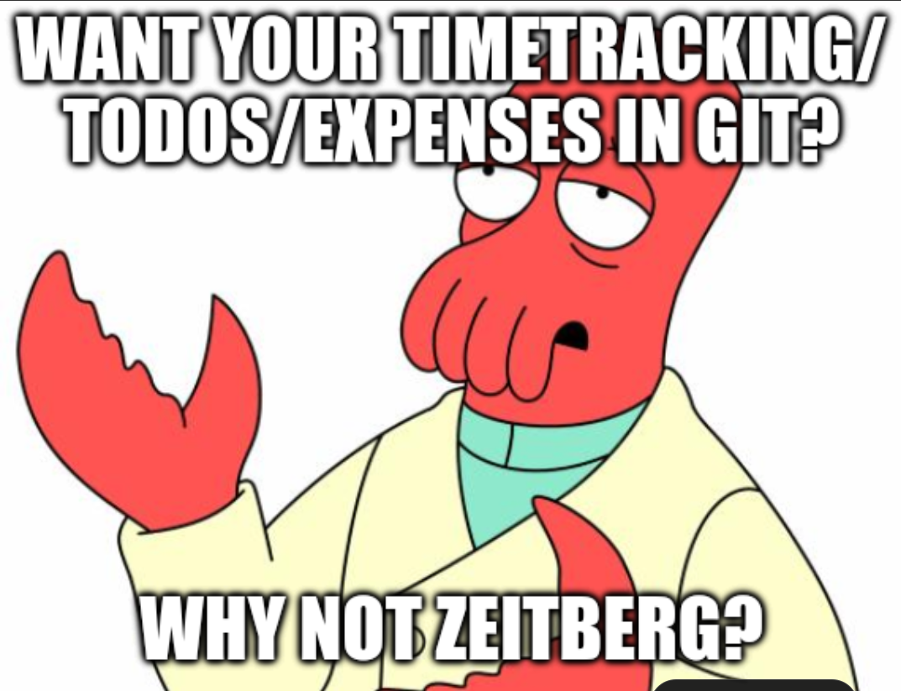

<p align="center">
  
</p>

<h1 align="center">zeitberg</h1>

<p align="center">
  <strong>Time · Tasks · Expenses → Git</strong><br />
  A static browser application whose data lives in your Git repository.
</p>

<p align="center">
  <a href="https://github.com/josephbirkner/zeitberg/actions/workflows/test.yml"></a>
  <a href="https://github.com/josephbirkner/zeitberg/actions/workflows/test.yml"></a>
  <a href="https://github.com/josephbirkner/zeitberg/releases/latest"></a>
</p>

---

zeitberg manages time, TODOs, and shared expenses. The public application is plain HTML, CSS, and JavaScript. It has no zeitberg-operated application server or database.

You choose a Git repository as the workspace. The browser reads and writes versioned documents directly through the provider API. The repository remains independently inspectable, cloneable, and portable.

**Your data, your Git repo.**

<p align="center">
  <picture>
    <source media="(prefers-color-scheme: dark)" srcset="./assets/architecture.svg" />
    
  </picture>
</p>

## What it gives you

| Component | Today |
| --- | --- |
| **Time** | Responsive weekly timeline, keyboard and touch editing, search, billable totals, work-hour requirements, overtime accumulation, undo/redo, and manual or idle-triggered Git commits. |
| **TODOs** | Shared projects and sections, recurring tasks, filters, completion history, durable drafts, imports, and optional GitHub issue linkage. |
| **Expenses** | Exact multi-currency splits, participant balances, deterministic settlement suggestions, categories, shared project assignments, durable drafts, and atomic Git saves. |
| **Workspace** | A versioned root manifest, portable JSON documents, stable project identities, private Git history, direct browser-to-provider persistence, and English/German UI. |
| **Quality** | Bidirectional GitHub issue projects, deterministic unit tests, browser-level smoke tests, static type checking, and an enforced 90% production-logic line-coverage gate. |

The project is intentionally one application: time, tasks, and expenses share a project inventory and workspace identity while retaining separate documents and views.

## Similar projects

No direct equivalent surfaced in our review. The closest projects each overlap with one part of zeitberg:

- [GitJournal](https://github.com/GitJournal/GitJournal) stores Markdown notes in a Git repository of the user's choice.
- [TaskRepo](https://github.com/HenriquesLab/TaskRepo) stores tasks as Markdown files in Git repositories.
- [ActivityWatch](https://github.com/ActivityWatch/activitywatch) is an automated time tracker with user-controlled local data, but is not Git-backed.
- [Actual Budget](https://github.com/actualbudget/actual) is a local-first personal-finance application with its own synchronization model rather than Git storage.

## Workspace setup

GitHub, GitLab.com, Codeberg, and compatible CORS-enabled GitLab/Forgejo servers use the same workspace and save pipeline. GitHub retains its PAT flow. GitLab and Codeberg accept provider tokens now; their Authorization Code + PKCE buttons become active when the deployment's public OAuth client ids are configured.

1. Create a **private** repository for your data and initialize its default branch, for example with a README.
2. Create an access token for that repository:
   - GitHub: a fine-grained PAT with `Contents: Read-only` to browse or `Contents: Read & write` to save.
   - GitLab: a PAT with API access, or the static PKCE flow when enabled on the deployment.
   - Codeberg/Forgejo: a repository-scoped token with repository read/write access. Forgejo OAuth grants are currently broader than scoped PATs, which the onboarding dialog states before authorization.
3. Visit [zeitberg.io](https://zeitberg.io), select the provider, enter the repository URL, branch, and token, then open the workspace.
4. If `zeitberg.json` is missing or invalid, Workspace settings opens a structured setup editor. Choose the shared name, timezone, projects path, and enabled components, then save. zeitberg creates only missing component documents and keeps existing repository data untouched.

You may instead copy [`workspace-template`](./workspace-template) into the repository and edit `zeitberg.json` before connecting. Both onboarding paths use the same workspace model and canonical seed documents.

Alternatively, choose **Create workspace** on the landing page. GitLab.com and Codeberg can create a private repository, initialize the checked-in [`workspace-template`](./workspace-template), validate its generated `zeitberg.json`, and open it without any zeitberg-operated backend. If a Forgejo-family server blocks browser cross-origin requests, connection preflight reports that limitation instead of treating it as malformed data.

A shell-based start looks like this after cloning this application repository:

```bash
mkdir zeitberg-data
cp -R workspace-template/. zeitberg-data/
cd zeitberg-data
git init
# Edit zeitberg.json before the first commit.
git add .
git commit -m "Initialize zeitberg workspace"
gh repo create YOUR_ACCOUNT/zeitberg-data --private --source=. --push
```

The token is kept in session storage by default. Selecting **Remember this token** opts into local storage. Authenticated requests go directly from the browser to the selected provider API; the static host never receives the credential. OAuth grants retain their refresh token in the same per-workspace credential record and refresh shortly before expiry.

After opening a workspace, use the first sidebar action beneath the zeitberg mark to manage connections. The browser keeps an ordered registry of repository URL, branch, bootstrap path, verified workspace ID, and display name. Each workspace token is stored separately, and switching repositories preserves unsaved drafts in a workspace-specific IndexedDB journal. Disconnecting one workspace does not log out or clear credentials for the others.

### Open workspaces and combined views

Remembered connections with available credentials load into independent sessions. The workspace name appears as a page title above the toolbar. When there are multiple choices for the current module, the title becomes a keyboard- and touch-accessible dropdown; a single workspace is shown as plain text. Each module remembers its selected workspace during the session; switching preserves selections, scroll positions, unsaved changes, and undo history. Unavailable repositories are identified beside the title and do not contribute partial data to combined results.

- **TODOs → All workspaces** shows origin-labelled tasks. Editing always targets the original repository. New tasks use one searchable **Workspace → Project → Section** field, remembering the last destination. Undo chooses the latest TODO edit across open workspaces; Redo follows the coordinated undo sequence. Selecting an individual workspace retains local history behavior.
- **Time-entry search** searches every accessible time-enabled workspace by default. Its detailed filters include a workspace selector, and results display their origin. Opening a result selects the correct workspace and entry, even when repositories reuse local IDs. Browser routes restore the combined TODO view and explicit search scope.
- **Save / Ctrl+S** saves pending documents across all open workspaces. Autosave uses the same pipeline **60 seconds after the latest applied edit**, including undo/redo; every edit restarts the shared countdown. Navigation and save acknowledgements do not restart it. Continuous editing therefore postpones autosave until you pause or save manually. The save button softly pulses while changes are pending and counts down to the next attempt, respecting reduced-motion preferences. Transient failures retain edits and retry after 60 seconds; expired credentials instead require reconnection. Unchanged workspaces produce no writes. Writes are serialized per repository; independent repositories can save concurrently. Completion acknowledges only the submitted snapshot, leaving newer edits dirty. GitHub issue reconciliation briefly locks its workspace's controls while remote task identities are reconciled; subsequent repository-file writes permit further editing. Saving does not clear undo history. Unsubmitted dialog fields remain drafts until you apply them. Browser suspension can delay an autosave; the countdown uses the actual deadline when execution resumes.
- The title has no close button. Connections are managed in workspace settings; disconnecting a dirty workspace first offers **Save and close / Cancel**. A failed save leaves it open and shows the error in the dialog. Disconnecting removes that connection's credential. Leaving the page warns while edits or saves remain pending.

Time calendars and expense ledgers remain separate documents; their hours and balances are never added across workspaces. No workspace data-format migration is required for multi-workspace browsing.

The same screen can share the active workspace in two forms:

- A **locator link** contains only the provider, repository URL, branch, workspace file and ID, selected component, and current view state. Its recipient supplies a credential independently.
- A **capability link** additionally carries a dedicated repository token in its URL fragment. The fragment is removed from the address bar before zeitberg performs authenticated network activity; zeitberg then remembers the credential in the browser and opens the workspace without interrupting the recipient. Because anyone holding the link receives the token's access, the sender must create a least-privilege, expiring token for only that repository, verify every repository/provider coordinate, and send the link as securely as the credential itself.

Ordinary routes, locator links, workspace records, cache keys, and repository documents never contain credentials. Opening a capability link authorizes the provider host encoded by its sender without an additional recipient confirmation.

The interface language is selected in Workspace settings. English and German share one first-party message catalog; the browser language supplies only the initial default, after which the explicit device preference wins. Dates, weekdays, numbers, durations, and currencies use `Intl` in the selected language while workspace calendar math continues to use the workspace's IANA timezone. Language changes do not alter route paths or write translated interface text into workspace documents.

If a project is bound to another GitHub repository for issue synchronization, the token additionally needs `Issues: Read & write` for that repository. Workspaces without such a binding do not need issue access.

## How the workspace works

`zeitberg.json` is the versioned bootstrap document. It declares:

- a stable workspace ID, name, and timezone;
- shared resources such as `data/projects.json`;
- enabled component types;
- repository-relative paths owned by each component.

The default template has this shape:

```text
zeitberg.json
data/
├── entries/                     # weekly files created as needed
├── index/entries-manifest.json
├── index/expenses-manifest.json
├── expenses.json
├── projects.json                # shared by time entries, TODOs, and expenses
├── todos.json
└── week-requirements.json
```

Time entries are normalized into ISO-week files. Their manifest records immutable Git blob SHAs, allowing IndexedDB to cache chunks safely without confusing an old revision for a new one.

The expense ledger stores money only as integer minor units with an explicit ISO currency. Exact payer contributions and owed allocations are authoritative; equal, percentage, and share rules are retained only as reproducible editing metadata. Its manifest hashes the precise ledger blob, and every save commits both files atomically.

TODOs, time entries, and expenses share the schema-v2 project/section taxonomy. Assignments use stable `project_key` and `section_key` values, so display names can change without rewriting historical records. Unsaved edits for all three components are journaled in IndexedDB; successful manual saves and autosaves clear acknowledged drafts while retaining newer edits. That journal protects against reloads but is not a substitute for a Git commit.

## Routes and browser history

The public root remains the landing and connection page. Initialized views use component-first routes:

- `/time` for the week timeline and Time search;
- `/todos` for tasks;
- `/expenses` for shared-expense ledgers and settlements.

The query string records the credential-free workspace locator and navigation state such as the selected week or TODO, filters, timeline zoom, and scroll time. PATs are never part of an ordinary route. Meaningful view changes create browser-history entries; high-frequency selection, filter, zoom, and scroll changes update the current entry. A small `404.html` handoff makes direct component-route reloads work on GitHub Pages without server-side rewrites.

## GitHub issue-linked TODOs

A workspace project can opt into GitHub issue persistence with an external reference:

```json
{
  "external_refs": [
    { "provider": "github", "id": "owner/repository" }
  ]
}
```

Sections may identify their repository-scoped issue label through a `github-label` external reference. At initialization and explicit refresh, zeitberg loads open and closed issues, filters out pull requests, maps recognized section labels, and conditionally revalidates an IndexedDB cache. GitHub remains authoritative for issue title, description, labels, and state; schema-v4 `todos.json` stores only small scheduling overlays for those tasks.

Edits remain local until an explicit task Save. That operation creates, updates, closes, or reopens issues first and then commits the compact TODO document, with optimistic conflict checks preventing a newer upstream edit from being overwritten. Project settings provide repository inspection and explicit connect/detach migration choices, so existing local tasks are never bulk-published silently. Local-server mode continues to write workspace files without making remote issue changes.

## Local development

Keep the public application and private workspace as sibling checkouts:

```bash
cd /path/to/checkouts
gh repo clone josephbirkner/zeitberg
gh repo clone YOUR_ACCOUNT/zeitberg-data
cd zeitberg
npm ci
npm test
python3 server.py --workspace ../zeitberg-data
```

Open <http://127.0.0.1:8000/time?source=local>. When the sibling is named `zeitberg-data`, `--workspace` may be omitted.

Local mode serves application files from this checkout and maps workspace reads plus `POST /save` to the separate data checkout. It writes JSON without committing; review, commit, and push data changes from that repository independently.

To test the GitLab or Codeberg connection instead of a local workspace, run:

```bash
python3 server.py --no-local
```

Then open <http://127.0.0.1:8000/>. This serves the provider login flow, disables the local workspace endpoints, and restores component routes such as `/time` to `index.html`. A plain `python3 -m http.server` cannot perform that route fallback and will return a missing page after login or a component-route reload.

### Employer schedules, overtime and leave

Open the overtime summary in the Time view to edit work requirements. Each employer has independent project assignments, effective-dated Monday–Sunday schedules, opening balances, annual vacation allowances and dated balance adjustments. A project can belong to only one employer account; only its billable entries count toward that account's overtime.

The seven-day table supports first-half/second-half **Work**, **Vacation**, **Sick leave**, **Holiday** and **Time off in lieu (Gleitzeit)** statuses, optional comments, and bulk editing of selected days. Required hours are read-only and derived from the schedule and leave. Gleitzeit keeps the requirement unchanged: absent work draws down overtime naturally, without consuming vacation or applying an extra deduction. Contextual leave on a non-working day consumes no vacation. Unused vacation carries forward; yearly allowances are explicit, never automatically prorated. Current-week overtime deducts requirements only through today.

Vacation planning shows **Taken | Planned | Unplanned** for the current calendar year, independently of the displayed week. Taken includes PTO through today; Planned includes later bookings in the year; Unplanned is carryover (including negative balances), annual allowance and adjustments minus both. Editing future PTO updates the planning preview immediately. Expand the calculation explanation for the budget breakdown.

Expand **PTO dates this year** to see the selected employer's charged vacation dates, full/half-day amounts, Taken/Planned status and comments. Clicking a date navigates the daily editor to its week without discarding pending changes; only OK saves, including edits made across multiple weeks. The list uses the same bookings as the annual totals, excluding uncharged annotations on non-working days.

Day headers show full dates and compact work/leave badges; clicking a badge opens that day's requirements. Click the week number in the upper-left corner to choose any date and jump to its week, including weeks without entries. The selected day is brought into the narrow sliding window and the week is reflected in the URL.

**OK saves the configuration immediately** through the existing local/Git provider pipeline; Cancel discards the dialog draft. Errors appear inside the dialog and leave the draft available for retry. The configured `week_requirements` path is unchanged; the new payload uses [schema version 3](schema/work-requirements-v3.schema.json). New workspaces start with no employers; adding an employer defaults to 40 hours, Monday–Friday, and no assumed vacation entitlement.

Legacy weekly documents remain readable with their original accounting, but historical conversion is a one-off edit in the private data repository, not an in-app wizard. Keep the original data in Git history and document uncertain mappings privately. Entry files do not need changing. Missing vacation allowances are highlighted and should be configured before interpreting the vacation balance.

`work-time.js` owns the daily accounting model and `work-time.view.js` the dialog. `WeekRequirements` preserves read compatibility; the entry store supplies timezone-aware billable totals using its weekly indexes.

### Test coverage

Run the same quality gate used by GitHub Actions:

```bash
npm run coverage
```

The command runs every deterministic Node test under c8 and a headless Chromium smoke suite against `workspace-template`. Both layers run even if one fails. It prints statement, branch, function, and line coverage; enforces at least 90% aggregate line coverage; and writes an HTML report, LCOV data, and `coverage-summary.json` under the ignored `coverage/` directory. CI retains that directory as an artifact even when the gate fails.

The measured first-party production scope is explicit in `package.json`: `appstate.js`, `autosave.js`, `cache.js`, `config.js`, `datasource.js`, `demo.js`, `locale.js`, `model.js`, `oauth.js`, `routing.js`, `session-binding.js`, `store.js`, `utils.js`, `version.js`, and `work-time.js`. This includes domain models, persistence and cache behavior, provider adapters, autosave scheduling, workspace switching, disposable demo fixtures, build labels, localization, routing, and shared utilities. Tests, generated or vendored assets, and one-off repository/import/build scripts are outside the production metric.

Both `npm run test:browser` and `npm run coverage` also run the employer/leave dialog integration tests against a disposable workspace, including bulk edits, failed-save recovery, save/reload persistence, legacy-write protection and narrow layouts. They never write to your personal data repository.

The dialog regression suite checks desktop, 320px/390px mobile and short landscape layouts in light/dark themes and English/German. It covers centered 44px close targets, clipping, sticky actions, expanded expense splits, inline validation, and preservation of optional task fields. Screenshots are written to a printed temporary directory. For Safari-engine checks, install WebKit with `npx playwright install webkit`, then run `node tests/dialogs.browser.mjs --webkit`.

The multi-workspace integration suite creates two disposable repositories with duplicate task and entry IDs. It exercises combined creation and history, origin-aware navigation, search scope restoration, delayed writes with newer edits in all three modules, failed-save recovery, idle autosave/reset/retry deadlines, close-page warnings, reduced-motion feedback, and narrow layouts. `workspace.sessions.js` and `workspace.todos.js` are browser-controller modules, tested through this real local HTTP workflow rather than included in the pure-logic Node coverage gate.

The DOM composition and browser-controller modules (`app.js`, `theme-init.js`, the `*.view.js` controllers, `workspace.js`, and `workspace.loader.js`) are excluded from the 90% Node/V8 gate because the application is served as unbundled browser modules under its production CSP. They are not hidden from measurement or automated validation: every coverage run launches the real static application in Chromium, records their separate line/function/branch execution in `coverage/browser-summary.json`, and checks local workspace initialization, component navigation, browser-history restoration, project/workspace/task/expense dialogs, and narrow full-screen layouts without credentials or private workspace data.

Repeat `--workspace` to test the multi-workspace switcher against several local repositories:

```bash
python3 server.py \
    --workspace ../zeitberg-data \
    --workspace ../zeitberg-shared-expenses
```

The server reads each repository's `workspace_id`, exposes only those explicitly selected roots, and keeps absolute filesystem paths out of browser routes. Local saves include the selected workspace ID so writes cannot cross into another exposed checkout.

### Stylesheet ownership

Styles are loaded explicitly from `styles/`: shared tokens, controls, application chrome, and dialogs belong in `common.css`; time tracking and time search belong in `time.css`; TODOs belong in `todos.css`; expenses belong in `expenses.css`; and the public site plus login belong in `landing.css`. Keep theme and responsive overrides beside the component they affect. New sub-apps should receive their own stylesheet instead of growing `common.css` by default.

Useful checks:

```bash
npm test
npm run typecheck
npm run check:data -- --workspace ../zeitberg-data
```

The one-way Todoist importer reads its token from `~/.todoist` and never copies it into a repository:

```bash
npm run import:todoist -- --workspace ../zeitberg-data
```

Use `--replace-todoist` to refresh an earlier import, `--active-only` to omit completed history, or `--completed-since YYYY-MM-DD` to choose an archive boundary.

## Hosting and provider authentication

### Playground and documentation screenshots

The front page’s **Try the playground** link opens `/time?demo=1`: a fictional workspace with time entries, employer requirements, tasks, projects, and shared expenses. Each reload or **Reset** discards edits and creates a fresh random scenario. Time covers the last 28 calendar days, ending today, with no entries beyond the current time. Workdays, weekends, full/half-day vacation, sickness and time in lieu produce matching activities and employer annotations; the following two weeks can also contain planned leave. Six shared projects, varied task priorities/due dates/completion/recurrence, and expenses with different payers and equal/weighted splits make the other modules explorable too.

Editing, undo/redo, and saving use the normal application pipeline, but documents and preferences stay in memory. The playground never reads your remembered repositories or credentials, opens IndexedDB, or writes to a Git provider or local workspace. **Exit demo** returns to the normal app. The banner remains visible to distinguish the playground from real data.

For a reproducible scenario, add an optional seed, for example `/time?demo=1&demoSeed=docs-v1`. It survives module navigation and reloads; without it, a fresh seed is generated in memory on each visit. Each date has its own seed-derived stream, so a fixed seed keeps already-completed days consistent as the rolling window advances. Reproducing the whole dataset also requires the same reference clock.

`npm run screenshots` starts an isolated server with local-workspace access disabled, freezes the browser clock to September 15, 2026, uses seed `docs-v1`, and captures desktop/mobile examples under `test-results/demo/`. The same scenario runs in CI and rejects repository requests and durable-storage access. No private data or screenshots of personal workspaces are used.

### Build identity and Pages release setup

The landing-page footer displays the app version and served commit (plus a local-changes marker in development). `server.py` supplies checkout metadata; `npm run build:site` creates a new `dist/` artifact with embedded commit metadata and revision-specific cache keys. An unbuilt static checkout honestly says `unbuilt` rather than looking up an unrelated remote HEAD. The build refuses to overwrite an existing output directory; optionally supply a fresh path with `npm run build:site -- /path/to/new-directory`.

At the 1.3 release, switch **Settings → Pages → Source** from branch publishing to **GitHub Actions**, then use `.github/workflows/pages.yml`. Its main-branch deployment publishes only the staged static files, including the matching build metadata. This follows GitHub’s [custom Pages workflow](https://docs.github.com/en/pages/getting-started-with-github-pages/using-custom-workflows-with-github-pages) model. Until then, the live Pages configuration is intentionally unchanged.

### Provider connections

The public deployment serves this repository from [zeitberg.io](https://zeitberg.io). You can also fork and host the same static files yourself, including from a private Pages deployment where your hosting plan supports one.

Provider connectors retain the same architecture:

- GitHub uses a fine-grained PAT and GitHub's REST/GraphQL APIs.
- GitLab uses its REST API, one atomic multi-action commit per save, and [Authorization Code + PKCE](https://docs.gitlab.com/api/oauth2/) when configured.
- Codeberg/Forgejo uses its REST contents API and either a [scoped PAT](https://forgejo.org/docs/latest/user/token-scope/) or [public-client PKCE](https://forgejo.org/docs/latest/user/oauth2-provider/). Because Forgejo OAuth scopes are not fine-grained today, a repository-scoped PAT remains the least-privilege option.
- custom HTTPS hosts are explicitly trusted, probed for GitLab/Forgejo compatibility and usable only when their CORS policy permits direct browser requests.

To enable OAuth on a static deployment, register two public applications with these exact callback URLs:

```text
GitLab:   https://zeitberg.io/?oauth_provider=gitlab
Codeberg: https://zeitberg.io/?oauth_provider=codeberg
```

Enable Authorization Code with PKCE and do not place a client secret in this repository. Put the resulting public client ids into the `zeitberg-oauth-gitlab-client-id` and `zeitberg-oauth-codeberg-client-id` meta elements in [`index.html`](./index.html). Self-hosted deployments use their own origin in both callback URLs. The application validates short-lived session state, requires S256 PKCE, scrubs callback codes before token exchange, refreshes expiring grants, and loads no third-party runtime scripts.

There is deliberately no GitHub App or OAuth broker today: GitHub's confidential OAuth and GitHub App flows require a server-held secret or private key, while the current fine-grained PAT flow remains fully static.

## License

Zeitberg is available under the [Apache License 2.0](./LICENSE).

## Credits and disclosure

The code for this project was written using large language models with extensive human supervision.

The zeitberg mark and landing landscape are original hand-authored SVGs. The mark's iOS and installable-web-app PNGs are reproducibly rasterized from [`assets/zeitberg-mark.svg`](./assets/zeitberg-mark.svg) by `npm run build:icons`. Interface icons use [Google Material Symbols](https://github.com/google/material-design-icons) under the [Apache License 2.0](./icons/LICENSE). The architecture graphic is an original SVG whose restrained visual language was informed by Kathryn Lavery's [Diagram Design](https://github.com/cathrynlavery/diagram-design) principles.

No generative or diffusion-based image model was used for the mark, landing landscape, or architecture graphic.

<p align="center">
  <a href="https://imgflip.com/memegenerator/Futurama-Zoidberg">
    
  </a>
</p>

[`assets/why-not-zeitberg-2.png`](./assets/why-not-zeitberg-2.png) is a meme created from the [Futurama Zoidberg template on Imgflip](https://imgflip.com/memegenerator/Futurama-Zoidberg). The underlying Futurama and Dr. Zoidberg artwork is third-party material, remains the property of its respective rights holders, and is not covered by this repository's Apache License 2.0. zeitberg is an independent project and is not affiliated with Futurama or Dr. Zoidberg.
